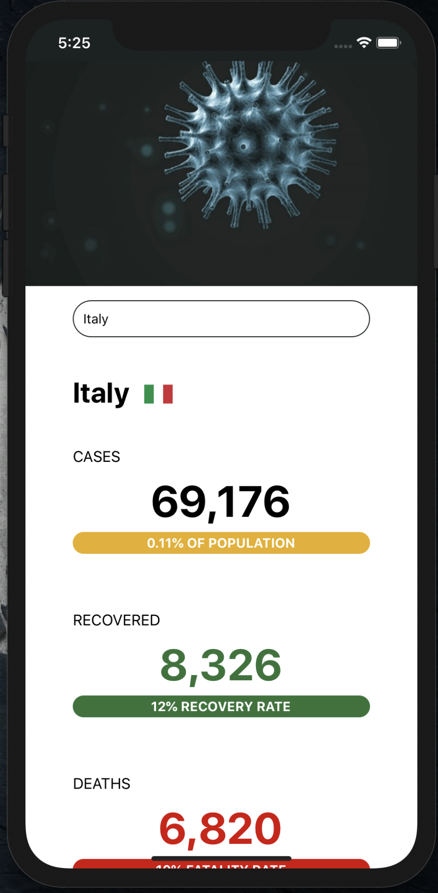

# Simple COVID-19 Data App

## General:
This application was built for educational purposes in order to get familiar with React Native.
 
The app shows updated data from around the world regarding the COVID-19 Coronavirus.
 
 
While not searching for a country, the general data for the whole world would be displayed.
 
After typing in the name of the country and pressing 'Search', data from the desired country will be displayed. See examples below.
 
 
The data displayed in this app is taken from the NovelCOVID API.
 
Check it out -  https://github.com/NovelCOVID/API

## Default State:

 
 
 

## Searching for a country:

 
 
 

## Running the App:
To install the App and its dependencies open the terminal and run `npm install`
 

### Android
`npm run android`

### iOS
`npm run ios`